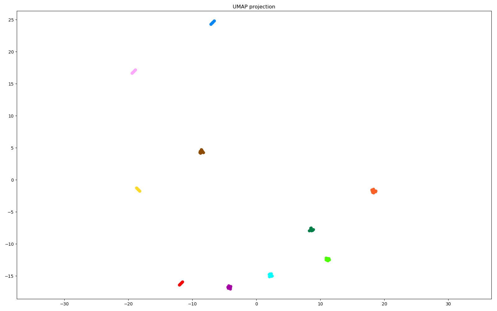

### Speaker Encoder

This is an implementation of https://arxiv.org/abs/1710.10467. This model can be used for voice and speaker embedding.

With the code here you can generate d-vectors for both multi-speaker and single-speaker TTS datasets, then visualise and explore them along with the associated audio files in an interactive chart.

Below is an example showing embedding results of various speakers. You can generate the same plot with the provided notebook as demonstrated in [this video](https://youtu.be/KW3oO7JVa7Q).



Download a pretrained model from [Released Models](https://github.com/mozilla/TTS/wiki/Released-Models) page.

To run the code, you need to follow the same flow as in TTS.

- Define 'config.json' for your needs. Note that, audio parameters should match your TTS model.
- Example training call ```python speaker_encoder/train.py --config_path speaker_encoder/config.json --data_path ~/Data/Libri-TTS/train-clean-360```
- Generate embedding vectors ```python speaker_encoder/compute_embeddings.py --use_cuda true /model/path/best_model.pth.tar model/config/path/config.json dataset/path/ output_path``` . This code parses all .wav files at the given dataset path and generates the same folder structure under the output path with the generated embedding files.
- Watch training on Tensorboard as in TTS
